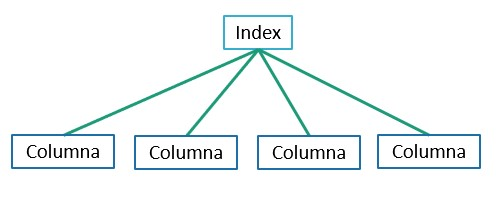
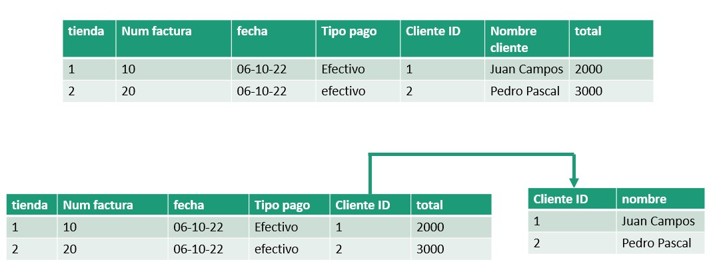
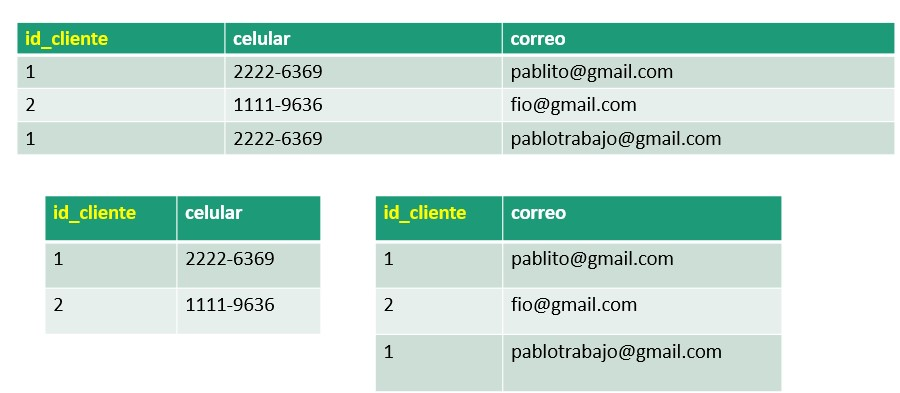

## Apuntes BD2 - Semana 10 - Viernes 30 de Septiembre 

> Estudiante: Andrea María Li Hernández - 2021028783

### Temas principales: Columnar Storage, Sistemas de almacenamiento de datos, FN3, BCNF y FN4

Queremos que haya consistencia e integridad de datos. Tenemos 2 formas de manejar la información:

1. Estática
2. Dinámica

Los archivos se almacenaban en registros, estos se mapeaban a estructuras de lenguaje (struct).

Archivos de acceso: **Aleatorio y Secuencial**.
- En el acceso aleatorio hacemos "brincos" en la memoria, con un puntero "seek".

**Inodes**: Son los file descriptors en Linux.
- El sector donde se encuentra el archivo se busca con el puntero.
- Si no hay localidad, se reduce el performance del sistema.
- Un varchar nos dice que es tamaño dinámico, pero el registro sigue siendo estático.

Desde un punto de vista de **optimización de storage**, cuando creo un registro y algo queda nulo, esto se representa con un número negativo, pero seguimos desperdiciando 4 bytes.

  
____
## **Columnas Sparse**

Voy a agarrar la info y si el usuario no tiene algún campo, no utilizo el almacenamiento del campo.

**Complejidad**: Se debe conocer de antemano el tamaño.

**Desventajas**: Desperdicio CPU.
- Siempre hay un *trade-off* de CPU, disco y memoria: Para que el procesador vaya rápido, debe tener toda la información disponible en memoria.

  
## **Columnar Storage**

La última optimización a nivel de disco que se da: **Sistema de almacenamiento de datos**.

Buscamos una forma de **optimizar** la información para **lecturas**.

- Porque en una BD tradicional guardamos en registros de tamaño estático o columnas sparse de tamaño dinámico, estamos usando un solo archivo. Lo cual es difícil de manejar.

Si voy a usar almacenamiento columnar, voy a usar **un archivo para cada columna**.

#### **Características**
1. Siempre ando buscando información específica, entonces no necesitamos buscar todo de golpe, dado que ocupo abrir un archivo por cada columna.
2. Cuando definimos un índice, nos permite darle velocidad a la búsqueda de datos. El índice más simple de dayos igual ayuda en rendimiento.
3. Si tengo un índice en forma de árbol con almacenamiento columnar, tendría algo como lo siguiente:

4. El acceso a disco por columnas es independiente, por lo tanto, es más rápido.

  
___
## **SQL**
Siempre para aumentar velocidad ocupamos desperdiciar algo -> **Atomicidad**.

**En bases SQL es difícil organizar datos** o planear porque es muy estático, en **NoSQL es más fácil**.

Una BD SQL agarra el texto a como está y lo mete en la BD.
- Los motores de búsqueda utilizan delimiters, que eliminan puntuación y otras cosas inútiles.

Es importante conocer el motor de BD y para qué sirve.
- Por ejm: Si quiero usar Elasticsearch para algo que no va usar **relevancia**, pues no tiene sentido. Para qué lo elegimos?

Hay que conocer el **use case del negocio**:
- El patrón de acceso de datos: Define qué tipo de columnas, tipo de índices y la organización de los datos.
- El planeamiento es clave para el buen rendimiento.

  
___
Hay 2 operaciones importantes en una BD: **Scan y Search**.

1. **Search**: Definir un índice sobre la columna del atributo. 

El motor primero busca el nombre -> la posición -> desplazamiento en el disco.

2. **Scan**: Búsqueda secuencial.

  
___

## **Tercera Forma Normal**
Los datos en bases SQL son muy estructurados -> **La recuperación de datos es lenta**.

**Los atributos deben estar relacionados a la primary key.**

Por ejemplo: Si cambio el nombre del cliente, esto no afecta al número de factura o a la tienda. Entonces sacamos el nombre a otra tabla y referenciamos con el ID. De esta forma, **forzamos que le nombre sea consistente**.

  
___

## **Forma normal Boyce-Codd (BCNF o F.N 3.5)**
Sigue el mismo principio que la FN3.
Voy a sacar las relaciones que se forman con **llaves primarias compuestas**. Tengo una tabla que tiene ambas.

- Repito menos, pero tengo que unir varias tablas.

Ejemplo:

  
___

## **Cuarta Forma Normal**
Siempre buscamos **reducir información repetitiva**.
Evitar casos donde un dato se pueda escribir de formas distintas y tener atributos multivaluados.

- Obtengo integridad referencial y me aseguro de que los datos siempre tengan la misma información.
- **Desventajas**: Voy a tener más tablas y la consulta va a ser más lenta.

Ejemplo:

